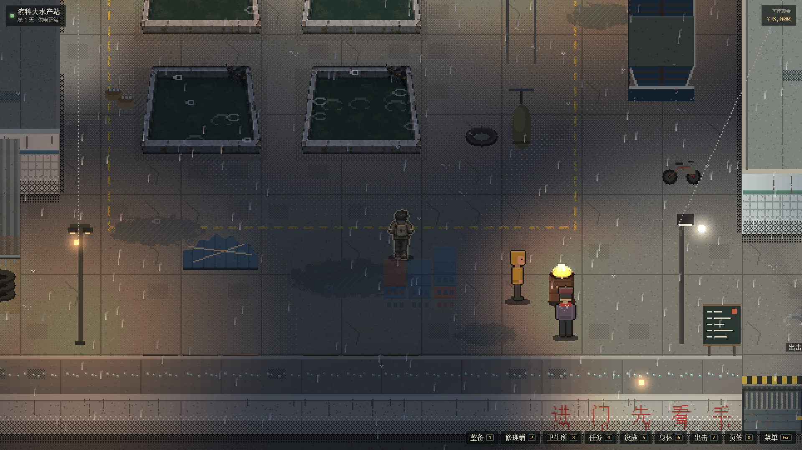
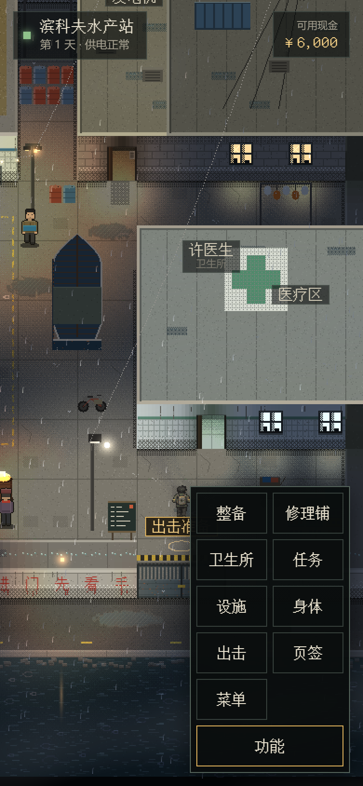

# 城中村样板与水产站院子：本次实现交付

2026-10-11。设计承接 [PR #22](https://github.com/xuys2025/escape-bincov/pull/22)，维护者明确要求另建实现 PR，先合并设计、再合并实现。玩家反馈继续登记 [#26](https://github.com/xuys2025/escape-bincov/issues/26)，AI 开发遗留集中登记 [#32](https://github.com/xuys2025/escape-bincov/issues/32)。登记不表示本轮继续开工。

## 已交付范围

- 默认进入可行走的水产站院子：真实 HideoutRuntime、受控旧档成长系统升级、库存交易、设施生产、训练、真实出击与回站报告；保留页签入口及图形启动失败回退。
- `?sample=village` 开启城中村 2.5D 样板，接真实 RaidRuntime 与原存档事务；未带参数的局内继续原路径。全沿海成品美术不在本次范围。
- 商店拖放、格子背包、音效、遮挡、死亡过程、潮水表现、菜单输入及两项上下文资源修复；沿用已确认的固定雨夜和素材范围。
- 保留两份离线单 HTML、网页 ZIP、便携 ZIP及第三方许可；游玩不依赖 CDN、远程字体或新增在线服务。

## 固定产品与验证

候选为本地 `c565d97`，产品来自 `68daab4`。本次整理不改其 `src/`、`assets/`、`tests/`、`scripts/`、依赖与构建配置，产品 SHA256 为 `112e7c8e37c91a218351b2fee03c008872bee5ca563d4262e431a57a845c5ef1`。归档仅针对历史验收资料，完整原始提交和工作树保留；见[归档说明](IMPLEMENTATION-ARCHIVE.md)。

Sol 独立结果见[最终报告](station-yard/sol-resource-r3-20261011/README.md)：275项单测、打包、院子76项、城中村51项及受影响回归；生命周期两尺寸各5/5；J1采样修正后新旧各6/6。三组各60轮及旧版对照分别支持旧RT空槽和同能力程序复用修复，不能据此签收总堆无增长。

本地最终整理已用 Node 24.19.0 / pnpm 11.19.0 重新执行单测 275/275 和打包，游戏包与候选逐字节一致；对应日志由维护者保留。远端是否通过以实现 PR 的当前 CI 为准，不能用历史报告冒充。生成 HTML 中原有的六处行尾空白保留，不手改生成物以改变已验收哈希；源码与说明另行检查。

## 剩余事项

模拟8/16能力反复切换监听增长、F20与原R/K观察、历史ASTRA-SAVE-01、后续素材/文案/接口/救济归属和设备验收均转至 #32。保留原 PASS / PARTIAL / UNCONFIRMED / NOT RUN，不将延期改写成已修复。新出现的存档丢失、交易不守恒、无法进入/出击/结算或必要CI失败仍需先处理。

真手机、真人手感、真实GPU/驱动内存与显示帧率未完成；模拟输入与无头WebGL不替代真实设备。本轮不继续开发昼夜、其他区域或新素材批次。

## 代表画面

以上为真实构建截图，使用验收夹具；完整原始截图见归档。
